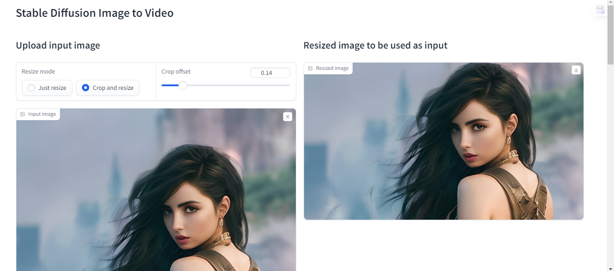
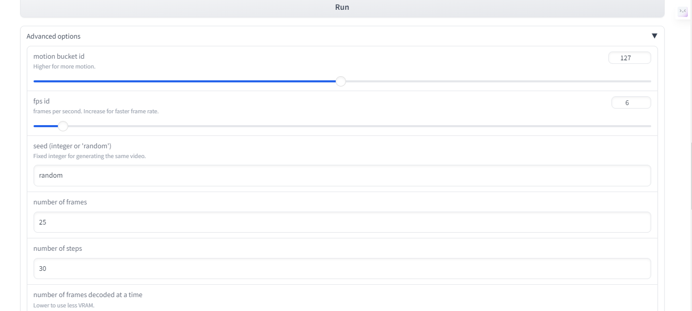

# Stable Video Diffusion img2vid
## What it does
A Google Colab notebook that launches a GUI to use Stability AI's [Stable Video Diffusion](https://github.com/Stability-AI/generative-models) (SVD) model.

## How to use
1. Open the Colab Notebook. 
2. Review options. Run the notebook.
3. Wait for the gradio.live link to appear. Click the link to start the GUI.
4. In the GUI, upload an initial image for the video.
5. Adjust `crop offset` to get the desired crop.
6. Press `Run` to generate a video.

